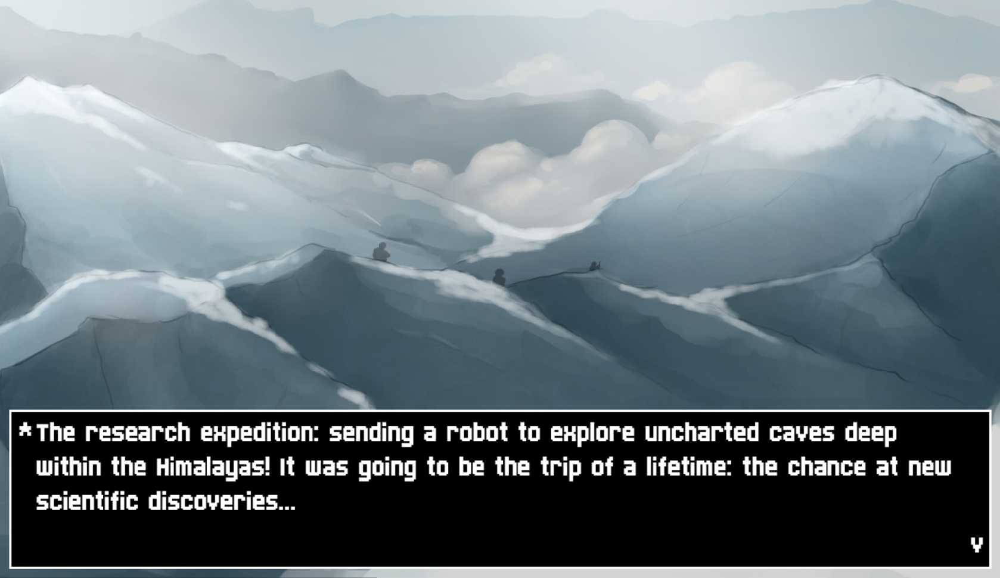
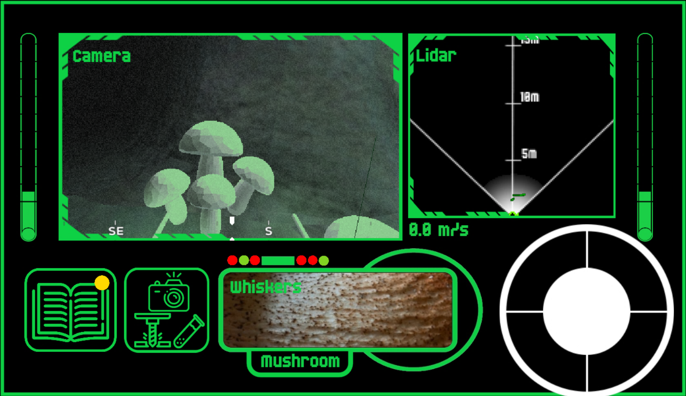
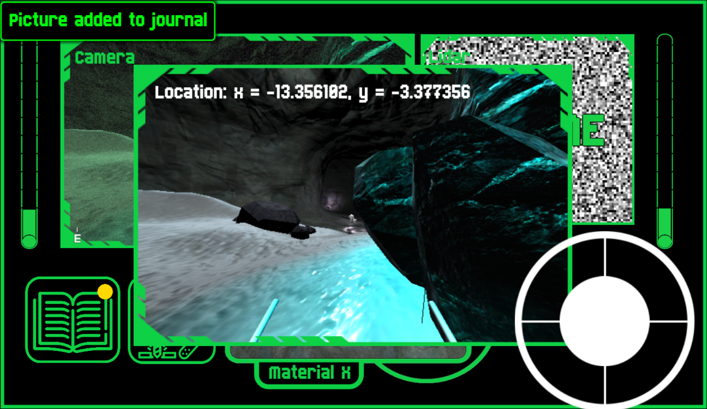
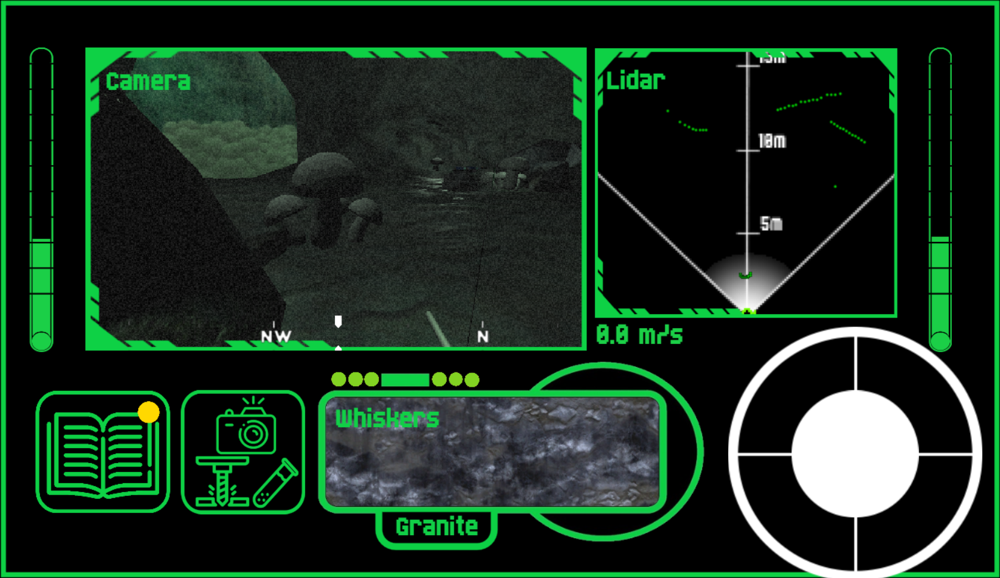

# RoC-eX: Robotic Cave Explorer

Unearth the truth about what happened in cave system #0393

Dive into the experience of piloting a robotic scout through what appears to be an ancient cave system leading down to the centre of the Earth. With the help of advanced sensors, guide your robot explorer along dark tunnels and caverns, avoiding obstacles, collecting relics of aeons past and, hopefully, discover what happened to its predecessor.

The game is available to play on itch.io here: 
- [https://mickeyli.itch.io/roc-ex-robotic-cave-explorer](https://mickeyli.itch.io/roc-ex-robotic-cave-explorer)

The source code on github is here:
- [https://github.com/FARSCOPE-UKRAS-Festival-Game-Dev/Robot-Explore-Game](https://github.com/FARSCOPE-UKRAS-Festival-Game-Dev/Robot-Explore-Game)

## About

In 2021 during those COVID years my PhD CDT cohort thought it would a fun idea to band together to make a game for an outreach project. Over the span of 3 months a team of over 10 of us worked together to deliver this game for the UKRAS 2021 Festival of Robotics aimed at both showcasing and educating the public at the work we do in robotics. 

I lead the endeavour ensuring overall project management to ensure delivery of the game to the festival. I was aided by Julian who lead the technical delivery team and Gaby who lead the art, narrative and game design team. We could not have acheived it without the many others who spent time creating, modelling, developing and testing the various parts of this project. 

The game was launched at the festival to great fanfare where Prof. Jonathan Rossitor and I gave a lecture and game walkthrough about the technologies and sensors we were hoping to teach the participants about. This can be found here: [video](https://youtu.be/_b-RuhgFj9E)

In the end the game ended up being a huge success with over 600 hits during the week and great praise from all involved! 

## Screenshots

  
   

  
   

## Credits

### Producers
* Mickey Li
* Julian Hird
* Gabriella Miles

### Game Development
* Julian Hird
* Mickey Li
* Wong Weijie
* Arturs Elksnis
* Kirsty Aquilina
* Peter Wharton
* Hendrik Eichhorn
* Zhun Chen Yek
* Mihai Anca

### Game Design and Art
* Gabriella Miles
* Valentina Lo Gatto
* Alex Smith
* Vimbai Gore-Strachan

### Story
* Gabriella Miles
* Valentina Lo Gatto
* Alex Smith
* Julian Hird

### Modellers
* Gabriella Miles
* Alex Smith
* Wong Weijie

### Testing
* Liam Fletcher

### Thanks to
* Paul Harper
* Michael Secker
* Aneta Taylor
* Prof Jonathan Rossiter
* Claire Asher
* UKRAS Robotics Festival 2021, ESPRC, FARSCOPE, University of Bristol, University of West England, Bristol Robotics Laboratory
* Made with Godot - godotengine.org/license
