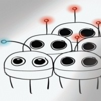

## About

Throughout our lives we interact with so many things, from the coins we use to pay for things to the roads and buildings which make up our infrastructure. But rarely do we stop to think at how our interactions can have knock on effects with other people who also interact with those same objects. Who pays with that coin in 10 years time? How many people has that coin been passed on to? Consider now the sonic landscape. Almost all of our actions and non-actions produce sound. From the clinking of breakfast making to the slamming of a door, the chirp of the bird outside to the wild bang of a summer thunderstorm. How do these sounds effect not only us, but the people and animals around us - at the end of the day it is our choice to create these sounds and participate in these activities. Therefore we must shed some light onto the effects of our actions.

The Forest is the concept of a distributed set of audiovisual 'trees' which, while individually unique, all have the capability of producing sounds and light patterns based on interactive stimuli. The dozen or so trees placed around a space like a forest create a unique atmosphere, curiously drawing people in to interact and play within.

One interaction could press a button to play the sound of a lion, whilst another somewhere else places an object on a pressure sensor to broadcast the sound of a rainforest. Periodically a spatial wind flutters through the trees. LEDs light up at the same time as the sound swells as someone cranks a handle. Two friends collaborate to send a message between two trees, the LEDs lighting the way like a packet being sent between two computers. Later a group of youngsters start a vote which propogates through the forest sparkling LEDs in turn, modulating volumes like a wave.

These are some of the interactions and effects we forsee in building this installtion. Ultimately we seek for the forest to simply provide the mechanics for people to play and discover how their choices may affect the future experiences of others. Whether that be understanding the importance of interactions with our natural environment, or understanding how voting systems can make or break consensus. All facilitated through the medium of sound and light.

This project is about the realisation of such a vision, its development and the processes of exhibiting it in the wild. This is in collaboration with a large team all working towards the same vision.

## Team

Mickey Li

Tom Didiot-Cook ([Link](https://www.linkedin.com/in/didiotcook/))

Suet Lee ([Link](https://www.linkedin.com/in/suet-lee-69b179115/))

Georgios Tzoumas ([Link](https://www.linkedin.com/in/georgiostzoumas/))

Henry Hickson ([Link](https://www.linkedin.com/in/henry-hickson-29360090/))

Avgi Stavrou ([Link](https://www.farscope.bris.ac.uk/avgi-stavrou))

Sergio Sierra ([Link](https://www.linkedin.com/in/sergiodsierram/))

Khulud Alharthi ([Link](https://www.linkedin.com/in/khulud-alharthi-172a98150/))

